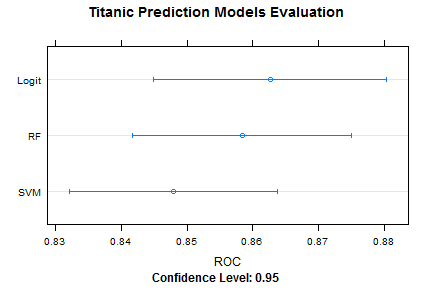

## Introduction

The Titanic was a British passenger liner that sank in the North Atlantic Ocean in the early morning of 15 April 1912 
after colliding with an iceberg during her maiden voyage from Southampton, UK to New York City, US. 

The sinking of Titanic caused the deaths of more than 1,500 people in one of the deadliest peacetime maritime disasters 
in modern history. Source: Wikipedia

The Titanic is also the theme for a machine learning competition on kaggle.com. The Titanic competition is a so called knowledge competition designed to learn as well as test your knowledge by competing against the community."
    
I have used the Titanic competion as theme for my Shiny App and Slidify presentation that I created for the Coursera course on Developing Data Products by the John Hopkins University.


---

## Women and Children First ?
The Titanic disaster was famous for the "Women and Children first" evacuation policy. 
Indeed a higher percentage of women and children survived!


 

Now let's select the main variables and compare some machine learning models ...

 


```
## 1 	 Title 
## 2 	 Sex 
## 3 	 Pclass 
## 4 	 Deck 
## 5 	 FamSize
```


---

## Model Evaluation

Receiver Operator Characteristic plots illustrate the performance of binary classifier systems as their discrimination threshold is varied. The plot shows the true positive against the false positive rate at various threshold settings.
Looks like we have a winner, or is it coincidence?

 


```
##  Area under the LogIt curve: 	 0.874258 
##  Area under the RF curve: 		 0.8642742 
##  Area under the SVM curve: 		 0.8385051
```


---

## Model Evaluation Summary

All models performed similar. All three models predicted passenger fatalities better than survivals, and none were significantly better or worse than the others. Having to pick one, I went for the Random Forest as it did have a slight, if insignificant, edge.

 

The final answer will be known at the end of the Kaggle competition in December 2014. Can you do better? 
Try it out on http://thiemom.shinyapps.io/dataproducts-titanic

The source code of this presentation is at http://github.com/thiemom/dataproducts-titanic


