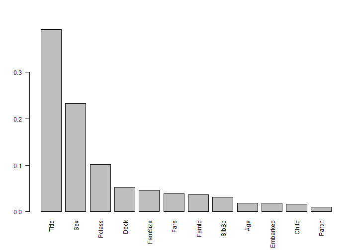
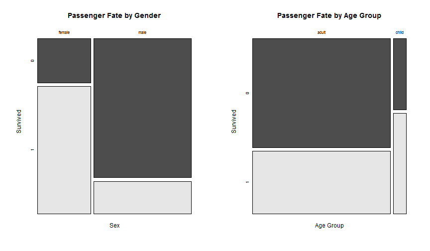

## About Me

My name is Thiemo. I am an engineer working in the Energy industry. 
One of my personal interests is Machine Learning. Ever since I discovered Coursera, I have been a great fan of it. 

Just wish I had more time to devote to it!    


--- .class #id 

## Introduction

The Titanic was a British passenger liner that sank in the North Atlantic Ocean in the early morning of 15 April 1912 
after colliding with an iceberg during her maiden voyage from Southampton, UK to New York City, US. 

The sinking of Titanic caused the deaths of more than 1,500 people in one of the deadliest peacetime maritime disasters 
in modern history. Source: Wikipedia

The Titanic is also the theme for a machine learning competition on kaggle.com. The Titanic competition is a so called knowledge competition designed to learn as well as test your knowledge by competing against the community."
    
I have used the Titanic competion as theme for my Shiny App and Slidify presentation that I created for the Coursera course on Developing Data Products by the John Hopkins University.


--- .class #id


## Titanic Data


Here is how to load up the training data from my github page for the Kaggle Titanic competion

```r
train <- read.csv(url('https://raw.github.com/thiemom/titanic/master/train.csv'), 
                  na.strings=c("NA",""))
```

Now let's look at the features and samples in the data

```r
names(train)
```

```
##  [1] "PassengerId" "Survived"    "Pclass"      "Name"        "Sex"        
##  [6] "Age"         "SibSp"       "Parch"       "Ticket"      "Fare"       
## [11] "Cabin"       "Embarked"
```

```r
nrow(train)
```

```
## [1] 891
```


---


## Exploring the Data

The goal of the competition is to predict if passengers in the test data have survived using Machine Learning techniques.

The workflow I followed was

1. Check for missing data
2. Visualize the data
3. Feature engineering
4. Variable selection
5. Model building


---


## Missing Data

to check for missing data I used the Amelia package missmap plot

 

```
## NULL
```


---

## Summary Missing Data

1. The Cabin feature has so much missing data that it is hard to imagine it will be of any use
2. The Age feature might be usable, but requires imputation!
3. The Embarked feature only has 2 missing observations, easy to fix
4. All other feature are pretty clean, they can be used as-is


---

## Fate of the Titanic Passengers

Most of the passengers in the training data did not survive the tragedy

 

```
##      [,1]
## [1,]  0.7
## [2,]  1.9
```


---


## Women and Children First ?
The Titanic disaster was famous for the "Women and Children first" evacuation policy. 
Indeed a higher percentage of women and children survived!


 

---

## Feature Engineering

After missing data imputation for Age and Embarked additional data features were engineered:

1. Consolidate and simplified Titles
  - Mrs, Miss, Mr, Master consolidated
  - New "honorific" First (women and children)
  - New "honorific" Last (noble men and Reverends)
2. Family size
  - Siblings, spouses, parents and children  
3. Family Identifier
  - Uniqie id combining the family sizes and surnames
4. Passenger deck

---


## Variable Selection

Variable importance was assessed using Random Forests using the Caret package. 

 


---

## Important Variables

The top 5 most important variables:

```
## 1 	 Title 
## 2 	 Sex 
## 3 	 Pclass 
## 4 	 Fare 
## 5 	 FamId
```

These variables have been used for the model building and evaluation


---


## Model Selection

For model selection the Caret package has been used. The caret package is a set of functions that attempt to streamline the process for creating predictive models.

First the training dataset was split in a model training (80%) and validation (20%) dataset. The test dataset cannot be used yet, it will be used at the end of the Titanic competition by Kaggle to determine the final model performance.

Finally 3 different machine learning techniques are compared.

1. Logistic Regression
2. Random Forest (RF)
3. Suport Vector Machine (SVM) with a radial kernel


---


## Response Operator Characteristic (ROC)


A ROC plot illustrates the performance of a binary classifier system as its discrimination threshold is varied. The curve is created by plotting the true positive rate against the false positive rate at various threshold settings.

 


```
##  Area under the LogIt curve: 	 0.7711144 
##  Area under the RF curve: 		 0.7787372 
##  Area under the SVM curve: 		 0.6376821
```


---

## Model Evaluation Summary

All models performed similar. All three models predicted passenger fatalities better than survivals, and none were significantly better or worse than the others. Having to pick one, I went for the Random Forest as it did have a slight, if insignificant, edge.

 


## Model Prediction

To create the final model, the selected Random Forest model was re-trained using all training data. How well it will do on the Titanic competion? We will see. For the moment my submission is scoring pretty high. But that does not at all mean the model will do well on the other 50% of the test data. We will see in December 2014!


---

## Acknowledgements


I learned a lot about R and the Titanic competition from these two tutorials

1. Stepen Trevors (trevorstephens.com/post/72916401642/titanic-getting-started-with-r)

2. Curt Wehrley (github.com/wehrley/wehrley.github.io/blob/master/SOUPTONUTS.md)


